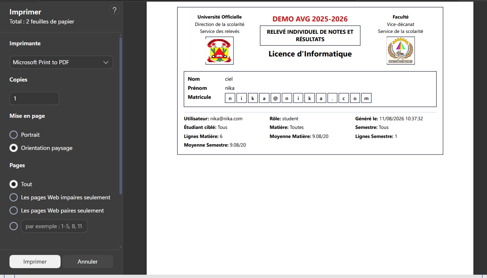
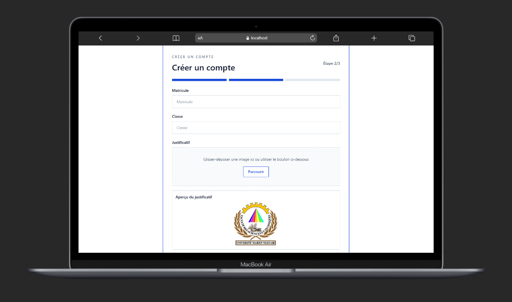
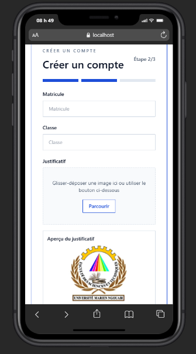
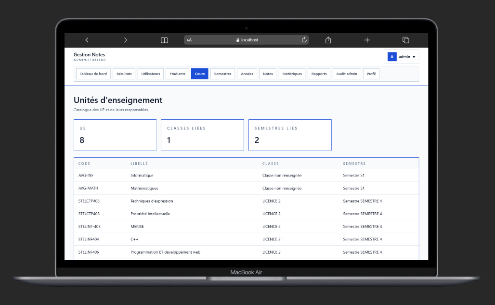
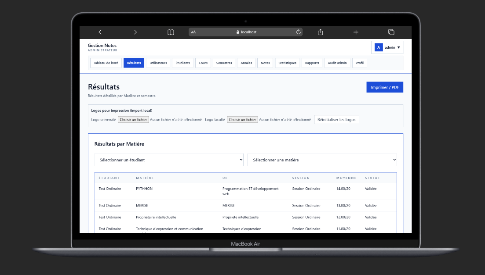
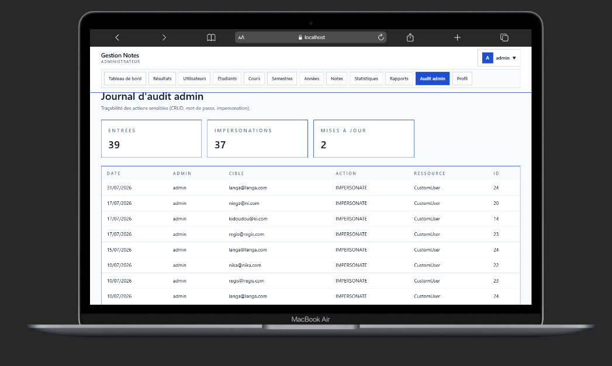
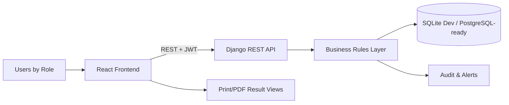
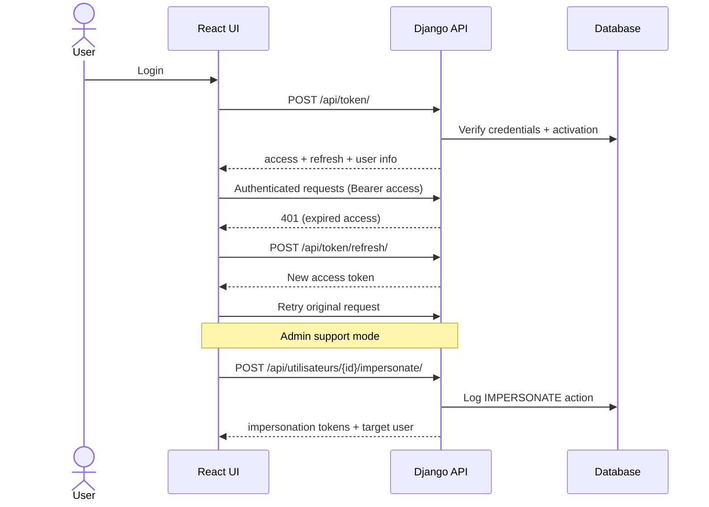
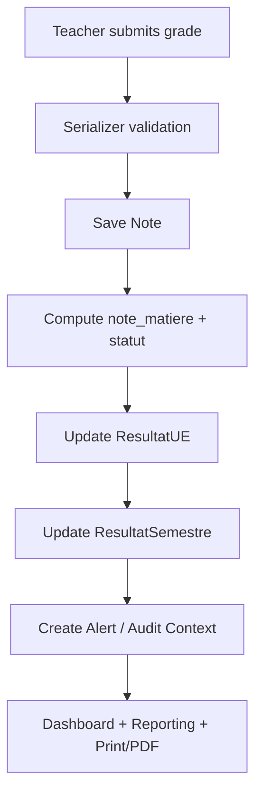
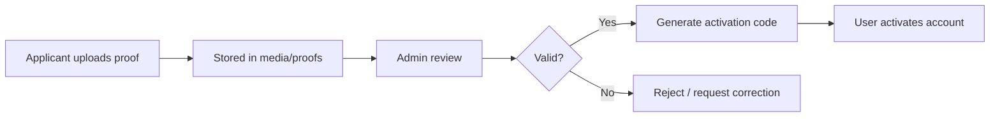

  # GestionNotes SaaS

## Upwork-Ready Product Pitch
A production-minded Academic Records Platform built with React + Django REST, designed to secure the full grade lifecycle from identity proofing to audit-ready reporting.

### Why this is a high-value build
- KYC-like onboarding for academic users (identity proof upload + supervised activation workflow)
- Role-driven operations (student, teacher, supervisor, admin) with API-first governance
- Automatic academic computations (subject -> UE -> semester) with status logic and persistence

! [Automatic academic computations Overview](./docs/screenshots/upA-12.png)

- Built-in traceability (alerts + admin audit logs + impersonation workflow for support ops)

! [impersonation workflow Overview](./docs/screenshots/upA-11.png)
- Print/PDF-ready result views for institutional reporting



! [Pdf Overview](./docs/screenshots/upA-13.png)

### Performance and reliability highlights
- API-first architecture with clean separation: UI / business logic / persistence
- JWT access + refresh flow with client-side auto-refresh interceptors
- Server startup health check passes cleanly after dependency normalization
- Data model optimized with indexes and relational integrity constraints
- Container-ready backend (Gunicorn + WhiteNoise) for deployability

### Business ROI snapshot
- Faster academic operations: less manual reconciliation, fewer grading disputes
- Stronger trust: auditable trails for sensitive actions
- Lower support cost: admin impersonation and centralized governance endpoints
- Deployment flexibility: local-first dev, cloud-ready production posture

## Screenshot Gallery (Drop-in Ready)
Place your PNG/JPG screenshots in `docs/screenshots/` and keep these paths.


**Want this exact system duplicated for your institution or adapted to your domain? Hire me on Upwork and I will ship a production-grade version tailored to your workflows.**

---

## Productized Sub-Apps (Monetizable Modules)

## 1) Identity & Access Control Engine



### 🌟 Business problem vs solution
Problem: Academic systems fail when identity is weak and role boundaries are blurry.
Solution: A full onboarding and access engine with proof upload, account activation, JWT auth, password reset, role-aware permissions, and controlled admin impersonation.

### 🛠️ Stack found in code
- Django 6 + Django REST Framework
- djangorestframework_simplejwt
- React + Axios interceptors
- Pillow for image handling
- Custom user model with role semantics and activation state

### 🚀 Why this implementation wins
- KYC-style onboarding is rare in academic SaaS and directly reduces identity fraud risk
- Automatic token refresh reduces session friction while keeping short-lived access tokens
- Admin impersonation is audit-linked, enabling secure support operations without blind debugging

---

## 2) Academic Operations Core (Grades, Classes, UE, Subjects)


### 🌟 Business problem vs solution
Problem: Manual grade pipelines cause inconsistency, latency, and errors.
Solution: API-centric CRUD and workflow orchestration for students, teachers, supervisors, classes, semesters, UEs, sessions, and subjects.

### 🛠️ Stack found in code
- DRF ViewSets + serializers + custom permissions
- Relational models with constraints and indexes
- React dashboard by role (admin/teacher/student/supervisor)

### 🚀 Why this implementation wins
- Strong domain modeling with unique constraints and computed consistency
- Low coupling between frontend and backend for faster feature velocity
- Ready to expose as institutional API products (internal portals, mobile apps, integrations)

---

## 3) Results Intelligence Engine


### 🌟 Business problem vs solution
Problem: Institutions lose time computing aggregates and explaining outcomes.
Solution: Automated computation pipeline from raw grades to UE and semester results, plus status assignment and report-ready views.

### 🛠️ Stack found in code
- Django model methods and sync functions for grade lifecycle
- ResultatUE + ResultatSemestre aggregation logic
- Frontend print/PDF-ready result pages

### 🚀 Why this implementation wins
- Deterministic calculation rules reduce disputes and post-processing
- Immediate recomputation on grade updates keeps data fresh
- Export/print-first UX supports real institutional operations

---

## 4) Governance, Alerts & Compliance Hub


### 🌟 Business problem vs solution
Problem: No traceability means no accountability.
Solution: Alert streams, role-bounded actions, and immutable-style admin audit logs for critical changes.

### 🛠️ Stack found in code
- Alert model + viewset actions
- AdminAuditLog model + read-only governance endpoints
- Permission classes and role checks across high-sensitivity operations

### 🚀 Why this implementation wins
- Operational transparency for administrators and supervisors
- Forensic-grade context (actor, target, before/after payload snapshots)
- Governance patterns reusable in fintech, HR, edtech, and govtech products

---

## Architecture Proof (Mermaid)

### Global system architecture


### Auth + refresh + impersonation flow


### Grade lifecycle and automatic academic sync


### Proof validation workflow


---

## Tech Stack (Verified from Codebase)
- Frontend: React 19, Vite 7, React Router 7, Axios, React Toastify, Tailwind CSS
- Backend: Django 6, Django REST Framework, SimpleJWT, django-cors-headers, django-filter
- Media/Files: Pillow, local media storage (cloud migration-friendly)
- Serving/Deploy: Gunicorn, WhiteNoise, Dockerfile available
- Data: SQLite in current config, PostgreSQL-ready dependencies installed

---

## API Surface (Core Endpoints)
- Auth
  - POST /api/token/
  - POST /api/token/refresh/
  - GET /api/me/
  - POST /api/register/
  - POST /api/activate-account/
  - POST /api/password-reset/request/
  - POST /api/password-reset/confirm/
- Domain resources (DRF router)
  - /api/utilisateurs/
  - /api/enseignants/
  - /api/superviseurs/
  - /api/classes/
  - /api/etudiants/
  - /api/annees-academiques/
  - /api/semestres/
  - /api/ues/
  - /api/sessions/
  - /api/matieres/
  - /api/resultats-ue/
  - /api/resultats-semestres/
  - /api/alertes/
  - /api/admin-audit-logs/
  - /api/codes-inscription/

---

## Professional Quick Start (Plug & Play)

### 1) Prerequisites
- Python 3.11+
- Node.js 18+
- npm 9+

### 2) Clone
```bash
git clone <https://github.com/Tecra-machineZ40/gestions_notes>
cd gestions_notes
```

### 3) Backend setup
```bash
cd backend
python -m venv ../venv
../venv/Scripts/python.exe -m pip install --upgrade pip
../venv/Scripts/python.exe -m pip install -r requirements.txt
copy .env.example .env
../venv/Scripts/python.exe manage.py migrate
../venv/Scripts/python.exe manage.py runserver 8000
```

Backend runs on: 

### 4) Frontend setup
```bash
cd ../frontend
npm install
npm run dev
```

Frontend runs on: http://localhost:5173, https://gestions-notes-ten.vercel.app/

### 5) Environment notes
- Frontend API URL fallback is http://localhost:8000/api, https://gestions-notes-ten.vercel.app/signup/api
- Backend CORS defaults already include localhost frontend origins
- Vercel SPA rewrites are configured in frontend/vercel.json

---

## Docker Backend (Production-Style Boot)
```bash
docker build -t gestions-notes-backend .
docker run --rm -p 8000:8000 gestions-notes-backend
```

Container start command uses Gunicorn with:
- backend.wsgi:application
- bind on 0.0.0.0:${PORT:-8000}

---

## Quality Signals
- Structured role-based dashboards
- Centralized API client with JWT refresh queue
- Computed academic results persisted server-side
- Alerting + audit endpoints for compliance visibility
- Print/PDF operational reporting integrated in UI

---

## Delivery Promise (Upwork)
If you need this system cloned, white-labeled, or adapted for your organization, I can deliver:
- End-to-end customization (workflows, roles, branding)
- Production deployment pipeline
- Security hardening and observability
- Feature roadmap execution (mobile app, OCR, AI anomaly detection, payment integration)

**Message me on Upwork with your use case and I will return a technical execution plan within 24 hours.**
